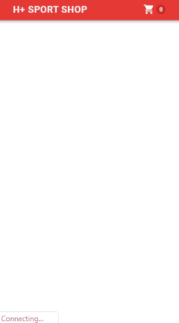

# hplussport-shop-vue
Vue.JS application that shows products from Hplussport API

All products and people associated with H+ Sport are also fictitious. Any resemblance to real brands, products, or people is purely coincidental. Information provided about the product is also fictitious and should not be construed to be representative of actual products on the market in a similar product category.

 

## Created with
1. Vue.JS
2. Vuetify
3. HPlusSport API 

## Demo
-

## Installation
1. `git clone https://github.com/fabriziopace/hplussport-shop-vue.git`
2. `cd hplussport-shop-vue`
3. `npm install`
4. `npm run serve`
5. go to `http://localhost:8080`
